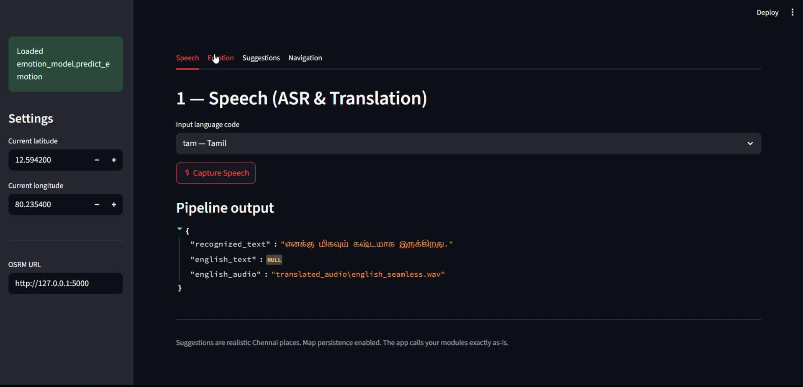
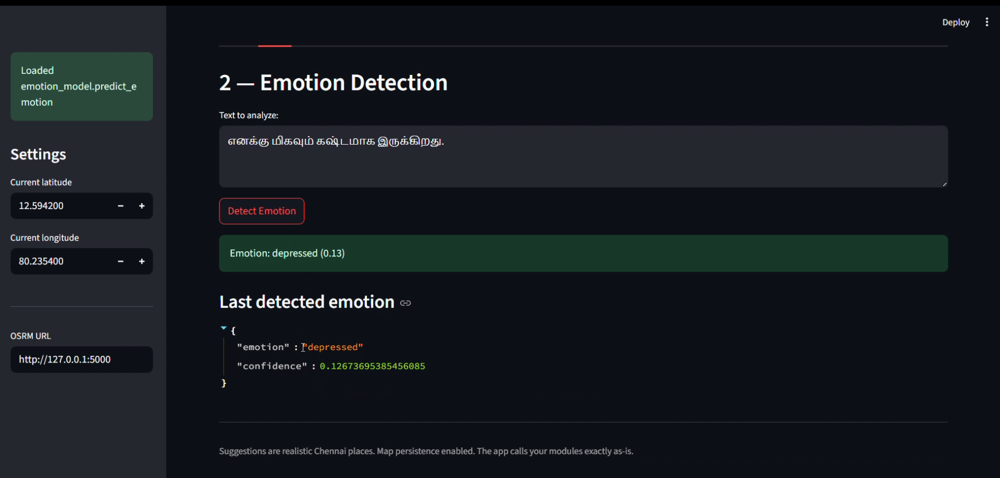
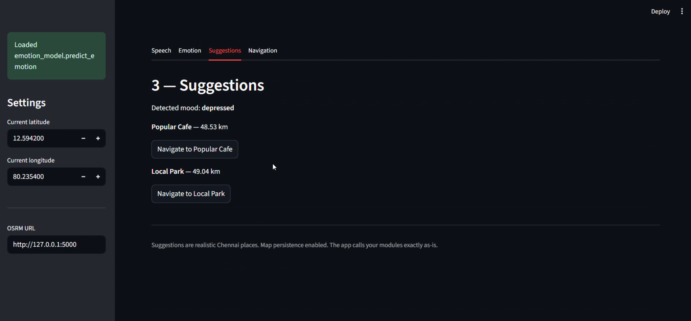
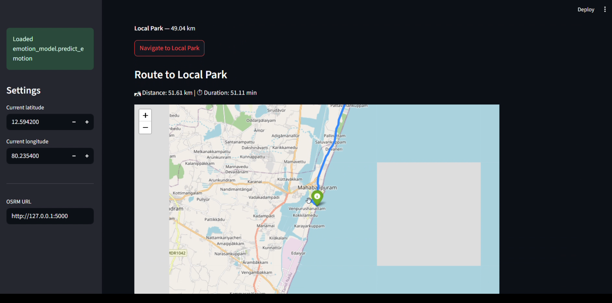

# 🧭 AI-Enabled Emotion Based Mapping System - Completely Offline

**Multilingual Speech → Emotion Detection → Location Suggestions → Navigation**

🚀 **Developed in just 2 days during the Hackathon period**

Dataset was artifically generated by AI, you can use your own data to train the model

This project demonstrates how **Generative AI, speech recognition, emotion analysis, and geospatial routing** can be combined to create an intelligent navigation assistant.

⚠️ Since this project was built within a **48-hour buildathon**, the system focuses on **demonstrating the concept and AI pipeline** rather than full optimization. Some components may require further refinement for production use.

---

# 📦 Project Overview

This project is an **AI-powered navigation assistant** that understands **user speech in multiple languages**, detects the **user's emotional state**, and suggests **nearby places with navigation routes**.

The system integrates:

- Speech Recognition
- Multilingual Translation
- Emotion Detection
- Location Recommendation
- Offline Routing

Most components run **offline**, making the system usable even with limited internet connectivity.

---

# 🚀 Features

### 🎤 Multilingual Speech Input

Supports speech in Indian languages such as:

- Tamil  
- Hindi  
- Telugu  
- Malayalam  
- Kannada  

Speech is converted to text using **Faster-Whisper (offline ASR)**.

---

# 🎤 Speech Recognition & Translation

The system captures speech and converts it into text using **Faster-Whisper**.  
It can then translate the speech using **Seamless M4T**.



---

# 😊 Emotion Detection

The translated text is analyzed using a **fine-tuned Transformer model** to determine the user's emotional state.

Supported emotions include:

- Happy
- Sad
- Angry
- Excited
- Neutral
- Depressed



---

# 📍 Emotion-Based Location Suggestions

Based on the detected emotion, the system suggests **realistic places near Chennai** that may match the user's mood.

Examples:

| Emotion | Suggested Places |
|-------|----------------|
| Happy | Beaches |
| Sad | Quiet parks |
| Excited | Amusement parks |
| Neutral | Cafes & malls |



---

# 🗺 Navigation

Users can choose a suggested location and generate a route using **OSRM (Open Source Routing Machine)**.

Navigation includes:

- Distance
- Estimated travel time
- Route visualization



Maps are rendered using **Folium inside Streamlit**.

---

# 🧠 System Architecture

```
User Speech
     │
     ▼
Faster-Whisper ASR
     │
     ▼
Seamless M4T Translation
     │
     ▼
Emotion Detection Model
     │
     ▼
Emotion-Based Location Suggestions
     │
     ▼
OSRM Routing Engine
     │
     ▼
Interactive Map (Folium + Streamlit)
```

---

# 📂 Project Structure

```
Ai-Enabled-emotion-based-mapping-system
│
├── app.py
│   Main Streamlit application
│
├── input_pipeline_fasterwhisper.py
│   Speech capture and Faster-Whisper ASR pipeline
│
├── emotion_model.py
│   Emotion classification model
│
├── osrm_route.py
│   Routing and navigation using OSRM
│
├── emotion_master_200k_balanced.csv
│   Dataset used for emotion model training
│
├── model_training.ipynb
│   Notebook used to train the emotion classifier
│
├── Speech to text.png
├── Emotion Detection.png
├── Giving Suggestions.png
├── Navigating.png
│   Application screenshots
│
└── README.md
```

---

# ⚙️ Installation

### 1️⃣ Create Virtual Environment

```
python -m venv venv
```

Activate environment:

```
venv\Scripts\activate
```

---

### 2️⃣ Install Dependencies

```
pip install streamlit
pip install folium streamlit-folium
pip install torch torchaudio transformers
pip install faster-whisper
pip install pyaudio webrtcvad
pip install noisereduce soundfile
pip install requests
```

---

# 🌏 Download Map Data

Download India map file:

https://download.geofabrik.de/asia/india.html

Place it inside the project directory:

```
india-latest.osm.pbf
```

---

# 🛠 Setup OSRM Routing Server

Download OSRM backend:

https://github.com/Project-OSRM/osrm-backend/releases

Extract the binaries.

---

### Extract Map

```
cd C:\osrm
osrm-extract india-latest.osm.pbf -p profiles/car.lua
```

---

### Partition Map

```
osrm-partition india-latest.osrm
```

---

### Customize Map

```
osrm-customize india-latest.osrm
```

---

### Start OSRM Server

```
osrm-routed india-latest.osrm
```

Server runs at:

```
http://127.0.0.1:5000
```

---

# 🧪 Test OSRM

Open in browser:

```
http://127.0.0.1:5000/route/v1/driving/80.28,13.05;80.23,12.59
```

If JSON appears, the routing server is working.

---

# 🚀 Run the Application

Inside the project directory:

```
streamlit run app.py
```

The web interface will open automatically.

---

# 🧰 Technologies Used

- Python
- Streamlit
- PyTorch
- Transformers
- Faster-Whisper
- Seamless M4T
- OSRM Routing Engine
- Folium Maps

---

# 🏆 Hackathon Purpose 

This project was **designed and developed within 2 days during some Hackathon.

The dataset was artificially generated by AI, you can create your own data for this project

The goal was to **rapidly prototype an AI-driven emotional navigation system**, demonstrating the integration of speech processing, emotion analysis, and geospatial routing within a short development cycle.

Due to the limited time frame, the project prioritizes **functionality and proof-of-concept over optimization**.

---

# 👨‍💻 Author

**Sinthanaiselvan G**

GitHub  
https://github.com/GS946GS

---

⭐ If you find this project useful, consider giving it a star.
